# Yamm FAQ Management System

Hey this is my project for the Go Developer coding task
I built a full FAQ management system with multi user support Admin Merchant and Customer
I tried to write the code in a senior style using the Repository Service Handler pattern so everything is in the right place clean and easy to scale later

## How I built this
I did not just write code I tried to think in a vertical slice way
I started with the database and migrations then moved to the repositories then the services for business logic and finally the handlers for the API
I wanted to make sure the core of the app which is the FAQ logic was solid before finishing the rest

## 1 Database and migrations
I used PostgreSQL and Goose for migrations

The check constraint
I added a rule in the faqs table
If an FAQ is global the store id must be null
If it belongs to a specific store it must have a store id
This keeps the data clean and prevents invalid data from entering the database

Cascading deletes
If a category or an FAQ is deleted all related translations are deleted automatically by the database

## 2 The hardest part FAQs and translations
This was the most complex part because one FAQ can exist in many languages like AR and EN

Transactions
I used database transactions in the service layer
When creating an FAQ the metadata is saved first then all translations are saved
If saving translations fails the transaction is rolled back so no empty FAQ exists in the database

Grouping
For the customer view I created a service that fetches all FAQs and groups them by category in Go
This makes it easier for the frontend to render category sections

## 3 Security and middleware
I built two middlewares that act as security guards for the system

AuthMiddleware
It validates the JWT token
The user id role and store id are stored inside the gin context so they are accessible across the request lifecycle

RoleMiddleware
This protects admin only routes
For example only admins can create categories or mark FAQs as global

IDOR prevention
Inside the FAQ service I never trust the store id coming from the request body
I always use the store id extracted from the JWT
This ensures a merchant cannot modify another merchants FAQs

## 4 Merchant auto store logic
When a merchant signs up I use a transaction to create the user and the store together
If store creation fails the user is not created
This keeps the system consistent and reliable

## Tech stack
Framework Gin
ORM GORM
Auth JWT and Bcrypt
Migrations Goose
Config Dotenv for database URL and JWT secret

## How to run the project
1 Set the env file with DATABASE_URL and JWT_SECRET
2 Run migrations using goose up
3 Run the app using go run app cmd api main go
4 Use the Postman collection to test register login and all CRUD operations for categories and FAQs

I added many comments in the code especially around the FAQ logic to explain why certain decisions were made 
I believe this structure is clean scalable and follows solid backend best practices

## Screenshots (Postman Testing)

### Authentication
**Register Admin**  
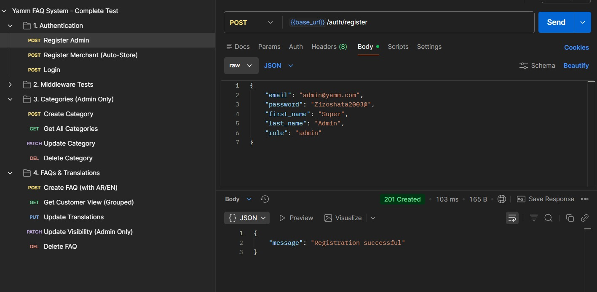

**Register Merchant (Auto-Store)**  
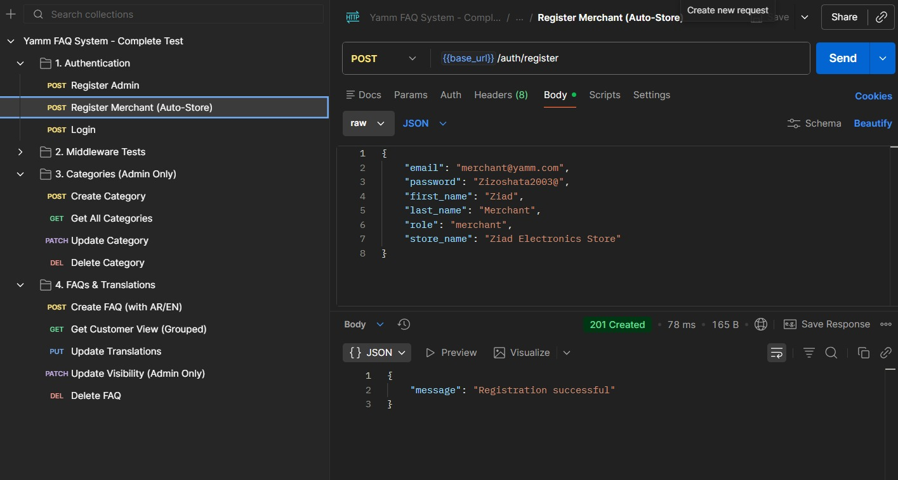

**Login**  
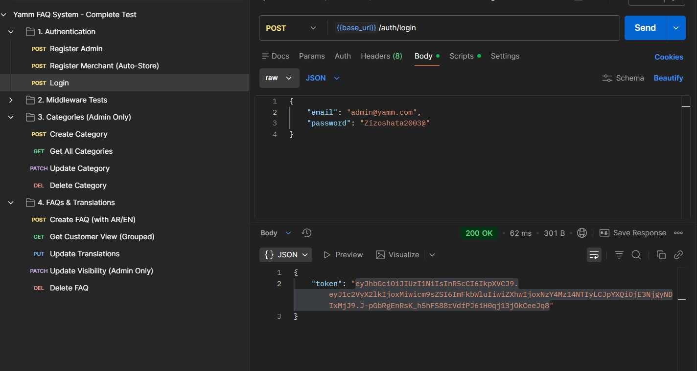

### Category Management
**Create Category**  
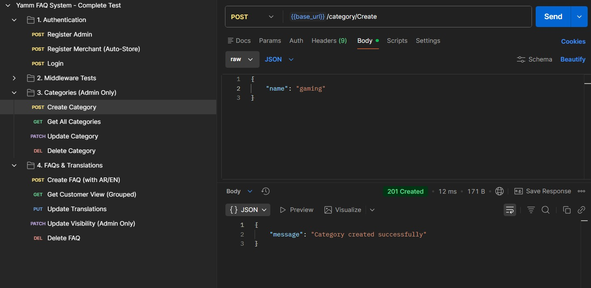

**Get All Categories**  
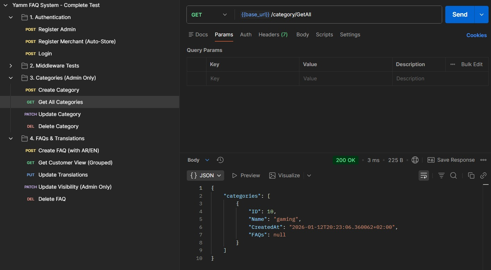

**Update Category**  
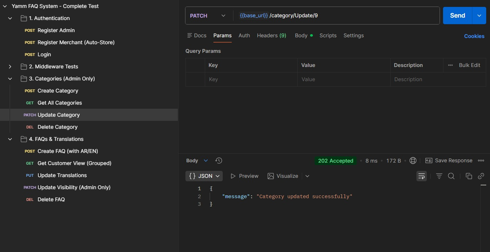

**Delete Category**  
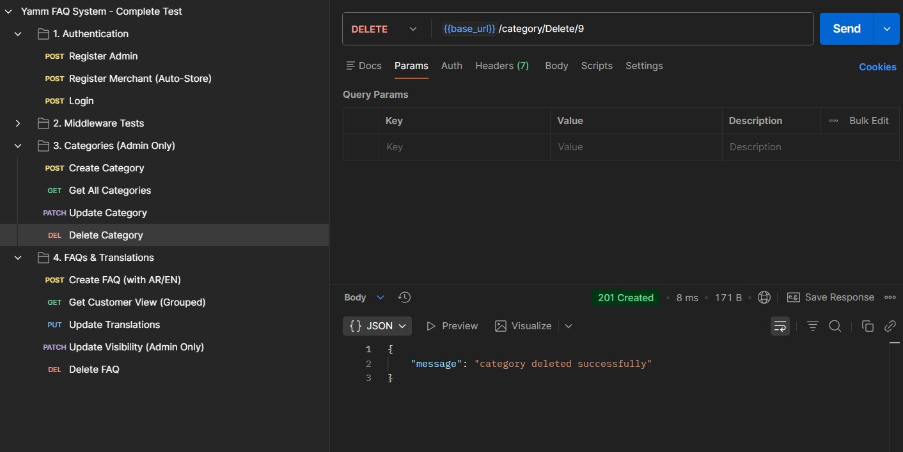

### FAQ Management
**Create FAQ with Translations**  
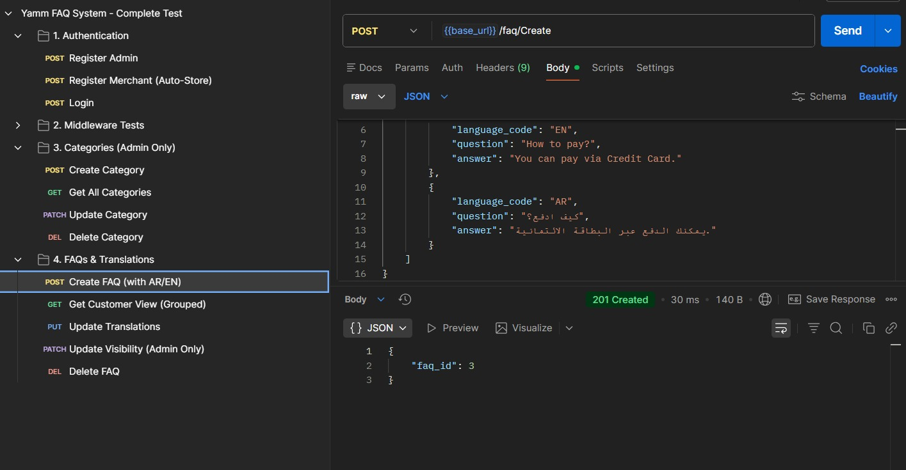

**Get FAQ (Customer Grouped View)**  
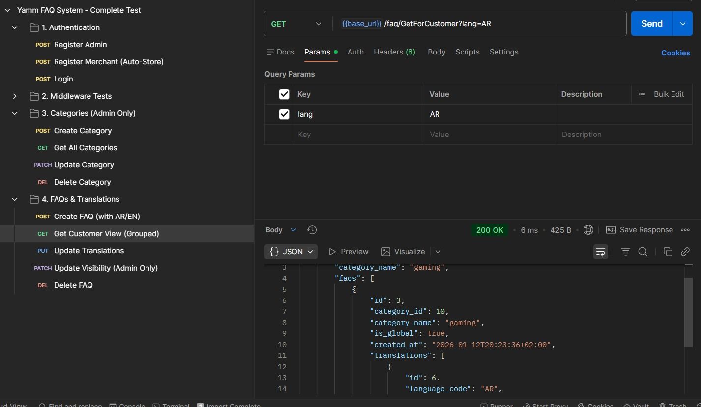

**Update FAQ Translation**  
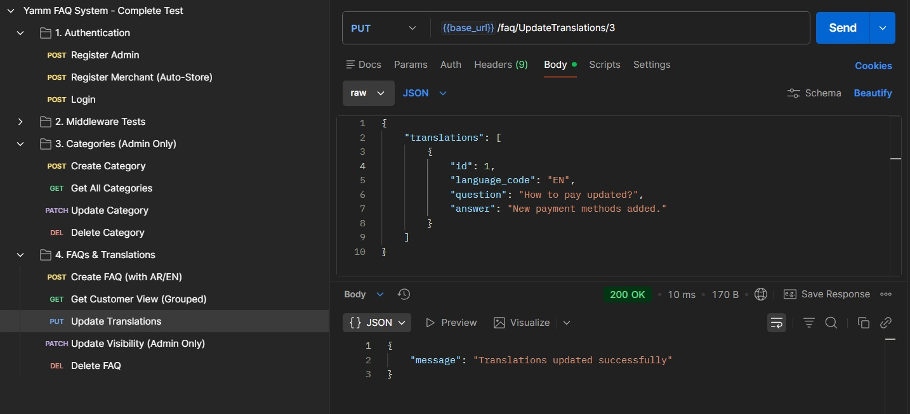

**Update FAQ Visibility**  
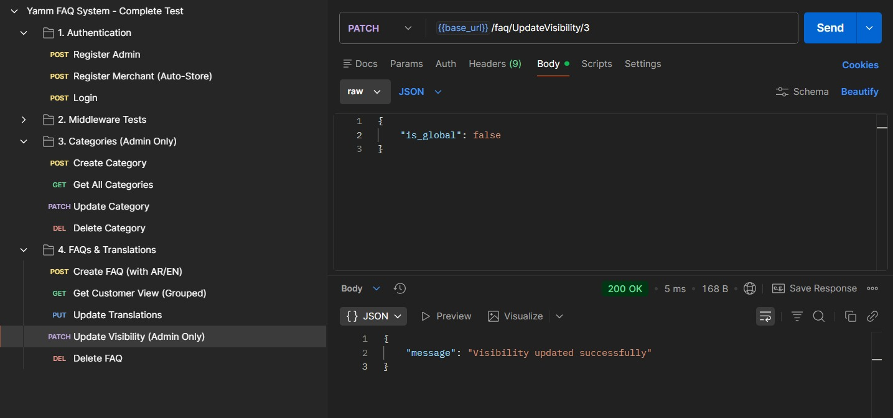

**Delete FAQ**  

